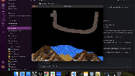

Just cd into this dir and run:
python .\main.py

This is particle simulation I made in pygame. This simulation allows you to play around with a few particle types such as rock, sand and water.
The particles merely move around and settle in their environment (no fun or explosive interactions... yet)

Controls:
    Left click: Spawn particles
    Space key: Reset entire grid
    Key P: Set grid to pachinko example (to observe gaussian distribution)
    Scroll Wheel: Increase or decrase brush size by scrolling wheel up or down

    Num Key 1: Select sand particles
    Num Key 2: Select water particles
    Num Key 3: Select rock particles
    Num Key 4: Select sticky sand particles (These will can fall sideways and stick to any particle below it)
    Num Key 5: Select eraser brush
    Num Key 6: Select image print brush

Enjoy!

This is the sand interating with water by forming a lake

This is an example of sand sinking down water

This is an example of rock particles being used to hold water like a container

This is an example of sand being held by rock and then being sunk down to water below

This is an example of gaussian distribution using a bunch of rocks as the pins and "sticky sand" as the bearings

This is an example of an image being loaded by the program into a bunch of sand pixels. The program supports png hence when the alpha channel is
0 on a pixel, no particle is spawned. Therefore we get this interesting "melting cheetah" effect

This is an example of everything working toguether in a finer simulation (for funsies)
